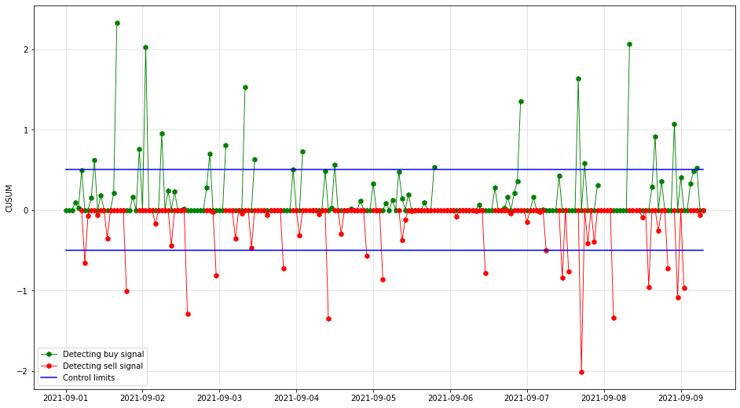
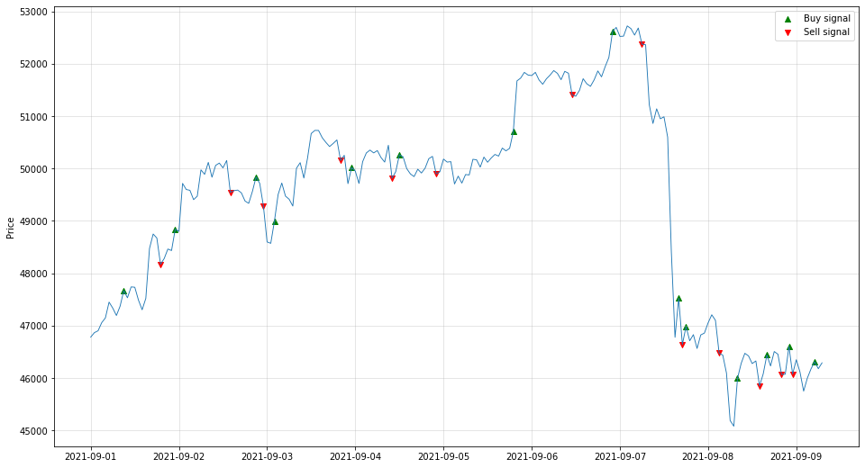
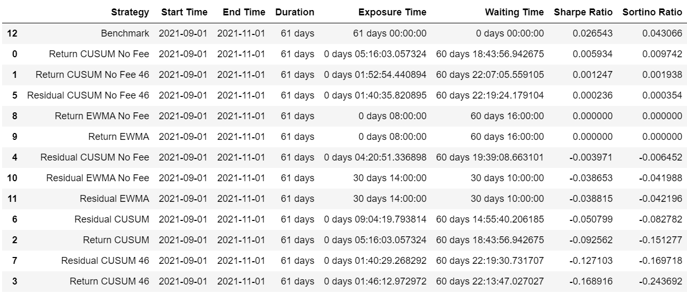
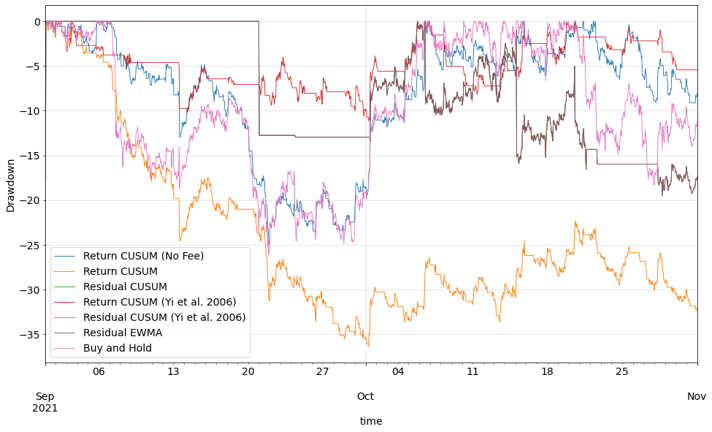

# Control Chart Based Trading Strategies Selector
Simulate and backtest 15 models derived from control chart methods (including CUSUM, EWMA, Risk adjusted). Report the key metrics and select the best trading strategy for given cryptocurrency.

## [cusumtrader.py](cusumtrader.py)
API source code.

### Instructions

- Use `.trade()` method to simulate all models at once.
- Use `.runModel(modelName)` method to run a specific model. 
    - For example, `.runModel('Residual CUSUM No Fee', feature='residualFeature', method='montgomery', fee=0)`.

- modelName can be:
    - 'Return CUSUM No Fee', 'Return CUSUM No Fee 46', 'Return CUSUM', 'Return CUSUM 46', 'Residual CUSUM No Fee', 'Residual CUSUM No Fee 46', 'Residual CUSUM', 'Residual CUSUM 46', 'Return EWMA No Fee', 'Return EWMA', 'Residual EWMA No Fee', 'Residual EWMA', 'Benchmark' (*46 means the Literature CUSUM model. Other CUSUM models are Montgomery.*)
    - You need to select proper `feature`, `method`, `fee` values for each model.

- Model's results are stored in a dictionary attribute `results`. You can access specific model's result by indexing.
    - For example, `.results[model]['signal plot']` will show the price plot with buy and sell signals.
- Keys in `.results` includes: 

          'signals':          trading signal table for this model 
          'signal plot':      price plot with buy and sell signals
          'backtest ratios':  key metrics from backtest
          'backtest df':      raw result table after backtest
     For CUSUM models:
          'score':            k, h score table
          'score plot':       k, h score plots
          'k', 'h':           k, h values
          'CUSUM plot':       CUSUM plot which trading signals based on
     For EWMA models:
          'EWMA plot':        EWMA plot which trading signals based on"
          
- Backtest results:
    - `.summary()` shows the table of key metrics.
    - `.equityPlot` and `drawdownPlot` will be updated after `.summary()` each time.

### Example plots
1. CUSUM plot for generating signals.
    

        
    

2. Corresponding trading signal with price plot.
    

        
    

3. Trading strategy comparison table.
    

        
    

4. Drawdown plot.
    

        
    

    
## [main.ipynb](main.ipynb)

A simple tutorial for the CUSUMTrader package.
